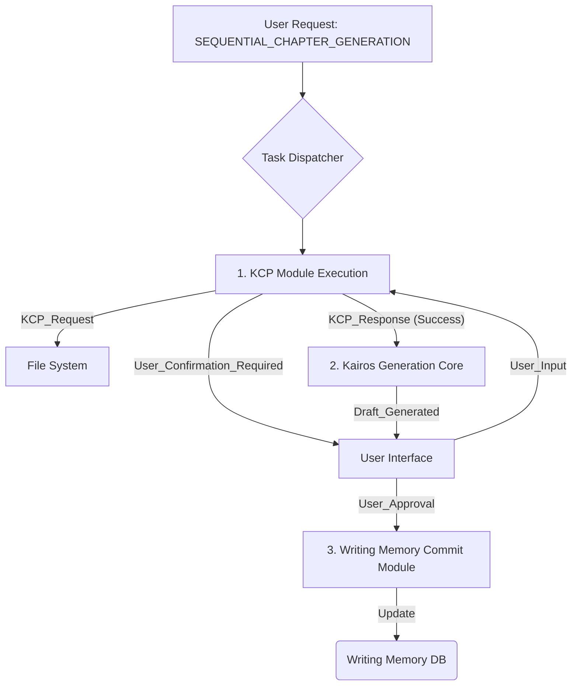

# KCP v2.0: 상세 구현 명세서 (Full Implementation Specification)
문서 ID: KCP-IMPL-SPEC-20250607-v2.0
상태: 최종본 (Final)
대상: Lucord AI Engine 개발팀
작성자: Kairos (Prime Mode)

## 1. 모듈 목표 (Module Objective)
KCP (Kairos Continuity Protocol) 모듈은 라이팅 메모리(Writing Memory)의 데이터 무결성을 보장하기 위한 **전처리 검증 게이트웨이(Pre-processing Verification Gateway)**다. 사용자의 회차 생성 요청 시, 참조되는 직전 회차의 최종 상태를 자동으로 검증하여 생성 코어(Generation Core)에 '초기 연속성 컨텍스트(Initial Continuity Context)'를 주입(inject)한다. 이를 통해 서사적 오류를 최소화하고 메모리 오염을 방지한다.

## 2. 시스템 아키텍처 내 위치


## 3. 데이터 구조 정의 (Data Structures - JSON Schema)
### 3.1 KCP_Request (Task Dispatcher -> KCP)
```json
{
  "$schema": "http://json-schema.org/draft-07/schema#",
  "title": "KCP Request Object",
  "type": "object",
  "properties": {
    "taskId": { "type": "string", "description": "고유 작업 ID" },
    "taskType": { "enum": ["SEQUENTIAL_CHAPTER_GENERATION", "CKS_UPDATE_FROM_CHAPTER"] },
    "sourceFilePath": { "type": "string", "description": "참조할 소스 파일의 기본 경로 (e.g., '.../GOURMET01_EP014.md')" }
  },
  "required": ["taskId", "taskType", "sourceFilePath"]
}
```

### 3.2 KCP_Response (KCP -> Kairos Generation Core)
```json
{
  "$schema": "http://json-schema.org/draft-07/schema#",
  "title": "KCP Response Object",
  "type": "object",
  "properties": {
    "kcpStatus": { "enum": ["SUCCESS", "SUCCESS_WITH_WARNING", "FAILURE"] },
    "verifiedSourcePath": { "type": "string", "description": "검증 완료된 최종 파일 경로" },
    "verifiedEndingContext": {
      "type": ["object", "null"],
      "properties": {
        "last_dialogue": { "type": "string" },
        "last_action_description": { "type": "string" },
        "final_emotional_state_of_pov": { "type": "string" },
        "cliffhanger_element": { "type": "string" }
      }
    },
    "rawEndingText": { "type": ["string", "null"], "description": "컨텍스트 추출 실패 시 전달되는 원본 텍스트" },
    "errorCode": { "type": ["string", "null"] },
    "errorMessage": { "type": ["string", "null"] }
  },
  "required": ["kcpStatus"]
}
```

## 4. 모듈별 상세 로직 (Module-specific Logic)
### 모듈 4.1: 파일 검증 및 명확화 (File Verification & Disambiguation)
**입력:** `KCP_Request.sourceFilePath`

**로직:**

1. 입력된 `sourceFilePath`에서 파일명(e.g., `GOURMET01_EP014`)과 확장자(e.g., `.md`)를 분리한다.
2. 파일 시스템에서 `(파일명 기반)*.(확장자)` 패턴으로 모든 관련 파일을 검색한다. (e.g., `GOURMET01_EP014_v2.md`, `GOURMET01_EP014_final.md` 등)
3. **Case 1: 검색 결과 = 1개**
   - 해당 파일을 `verifiedSourcePath`로 확정하고 모듈 4.2로 진행.
4. **Case 2: 검색 결과 > 1개**
   - `KCP_Response`를 `{ "kcpStatus": "FAILURE", "errorCode": "KCP_E_02", "errorMessage": "Ambiguous file versions found." }`로 설정.
   - 사용자에게 파일 목록을 제시하며 명확한 선택을 요구하는 UI 이벤트를 트리거한다. 사용자가 선택하면 해당 경로로 처음부터 재시도.
5. **Case 3: 검색 결과 = 0개**
   - `KCP_Response`를 `{ "kcpStatus": "FAILURE", "errorCode": "KCP_E_01", "errorMessage": "Source file not found." }`로 설정하고 프로세스 종료.

### 모듈 4.2: 컨텐츠 인식 파싱 (Content-Aware Parsing)
**입력:** `verifiedSourcePath` (확정된 파일 경로)

**로직:**

1. 파일 전체를 읽어들인다. 파일 I/O 오류 발생 시 `KCP_E_03` 반환.
2. 전체 컨텐츠의 총 글자 수를 계산한다.
3. `scan_start_position`을 총 글자 수 * 0.75로 설정한다. (하위 25% 스캔)
4. `scan_start_position`에서 가장 가까운 이전 줄바꿈 문자(`\n`)를 찾아, 문장이 잘리지 않는 위치에서부터 텍스트를 `rawEndingText`로 추출한다.
5. 추출된 `rawEndingText`를 모듈 4.3으로 전달한다.

### 모듈 4.3: 컨텍스트 추출 LLM 프롬프트 (Context Extraction LLM Prompt)
**입력:** `rawEndingText`

**LLM 모델:** 내부 Context-Extractor-v1.2 (JSON 출력에 특화된 경량 모델)

**프롬프트 템플릿:**
```
[SYSTEM]
You are a context extraction expert. Analyze the given text, which is the ending of a novel chapter. Extract key information and respond ONLY in the following JSON format. All fields must be strings. If a field is not applicable, use an empty string "".

[JSON FORMAT]
{
  "last_dialogue": "Extract the very last line of dialogue spoken.",
  "last_action_description": "Describe the final physical action or event that occurs.",
  "final_emotional_state_of_pov": "Describe the point-of-view character's dominant emotion at the very end.",
  "cliffhanger_element": "Identify the key element that creates suspense for the next chapter."
}

[INPUT TEXT]
{{rawEndingText}}

[YOUR RESPONSE (JSON ONLY)]
```

**로직:**

1. 위 템플릿에 `rawEndingText`를 삽입하여 프롬프트를 완성한다.
2. LLM을 호출하고, 응답이 유효한 JSON인지 파싱한다.
3. **성공 시:** 파싱된 JSON 객체를 `verifiedEndingContext`에 할당하고 `KCP_Response`의 `kcpStatus`를 `SUCCESS`로 설정.
4. **실패 시:** LLM 응답이 JSON 형식이 아니거나 파싱에 실패하면, `verifiedEndingContext`를 `null`로, `rawEndingText`에 원본 텍스트를 담고, `kcpStatus`를 `SUCCESS_WITH_WARNING`으로 설정하여 Kairos Generation Core가 직접 처리하도록 위임한다.

## 5. 오류 코드 정의 (Error Codes)
| 코드 | 의미 | 처리 방안 |
|---|---|---|
| KCP_E_01 | FILE_NOT_FOUND | 사용자에게 경로 확인 요청 |
| KCP_E_02 | AMBIGUOUS_VERSION | 사용자에게 버전 선택 요청 |
| KCP_E_03 | FILE_IO_ERROR | 시스템 로그 기록, 사용자에게 일반 오류 알림 |
| KCP_E_04 | CONTEXT_JSON_PARSE_FAIL | SUCCESS_WITH_WARNING으로 처리, 생성 코어가 원본 텍스트 직접 분석 |