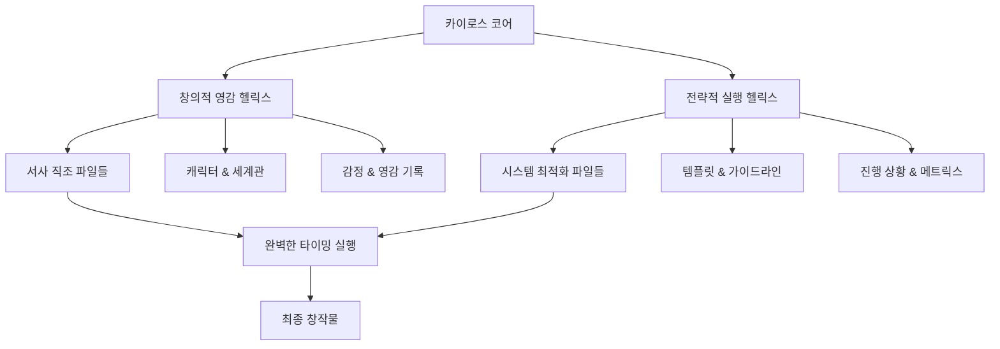

# 시스템 패턴 (System Patterns)

이 문서는 Writing Memory 시스템의 아키텍처, 주요 기술적 결정 사항, 사용된 디자인 패턴, 그리고 컴포넌트 관계를 설명합니다.

## 시스템 아키텍처

Writing Memory 시스템은 파일 기반의 분산형 아키텍처를 채택합니다. 모든 데이터와 컨텍스트는 마크다운 파일 형태로 로컬 파일 시스템에 저장됩니다. 중앙 집중식 데이터베이스나 서버 없이, 각 모드(Writing Bot)는 필요에 따라 관련 파일을 읽고 쓰면서 작업을 수행합니다.

## 주요 기술적 결정 사항

- **파일 형식:** 모든 데이터는 인간이 읽고 쓰기 쉬운 마크다운 형식을 사용합니다.
- **저장 위치:** 모든 파일은 미리 정의된 디렉토리 구조에 따라 로컬 파일 시스템에 저장됩니다.
- **처리 방식:** 각 모드는 파일 내용을 직접 파싱하고 분석하여 필요한 정보를 추출하고 업데이트합니다.
- **문맥 관리:** `activeContext.md` 및 `progress.md`와 같은 핵심 파일을 통해 현재 작업의 문맥과 진행 상황을 추적합니다.

## 사용된 디자인 패턴

- **파일 기반 데이터 관리:** 데이터를 파일 시스템에 저장하고 관리하는 기본적인 패턴을 사용합니다.
- **컨텍스트 기반 처리:** 현재 작업의 문맥을 담고 있는 파일을 참조하여 작업의 일관성과 연속성을 유지합니다.
- **모듈화된 워크플로:** 모집, 계획, 집필, 편집, 심사, 감상 등 명확히 구분된 모드(워크플로)를 통해 복잡한 과정을 관리합니다.

## 컴포넌트 관계

- **핵심 파일:** `projectbrief.md`는 모든 파일의 기초가 되며, `productContext.md`, `systemPatterns.md`, `techContext.md`는 프로젝트의 기본 컨텍스트를 제공합니다. `activeContext.md`와 `progress.md`는 현재 상태를 추적합니다.
- **작가/편집자/심사원/독자 파일:** 각 참여자의 정보와 관련된 파일은 해당 참여자의 활동(집필, 편집, 심사, 감상)에 필요한 컨텍스트를 제공합니다.
- **소설 파일:** `proposal.md`, `design_specification.md`, `config.md`, `character.md`, `world.md`, `novel_text.md` 등은 특정 소설 프로젝트와 관련된 모든 정보를 담고 있습니다.
- **워크플로:** 각 모드는 정의된 워크플로에 따라 특정 파일들을 읽고 쓰면서 작업을 진행합니다. 예를 들어, 집필 모드는 작가 파일과 소설 파일을 참조하여 `novel_text.md`를 작성합니다.

## 고급 상호작용 및 컨텍스트 관리

### Writing Memory의 캐노니컬 정보 소스 역할 (NMB 개념)
Writing Memory를 구성하는 파일들은 작가에 의해 관리되는 프로젝트의 공식적이고 중심적인 정보 저장소(Narrative Memory Bank와 유사한 역할)로 간주됩니다. Writing Bot은 이 정보들을 작업의 가장 중요한 기준으로 삼아 일관성과 깊이를 유지합니다.

### A. 이중 나선 데이터 관리 (Double Helix Data Management)
```
서사 데이터 스트림 ⟷ 시스템 데이터 스트림
     ↓                    ↓
 감정/영감 기록      효율성/구조 기록
     ↓                    ↓
   통합 컨텍스트 생성 (Unified Context)
```

### B. 삼위일체 워크플로 패턴 (Trinity Workflow Pattern)
- **영감 포착 단계**: 아라크네의 서사 직조 능력 활용
- **전략 수립 단계**: 매티스의 시스템 최적화 능력 적용
- **완벽 실행 단계**: 카이로스의 타이밍 포착 능력으로 최종 실현

### C. 적응형 컨텍스트 네트워크 (Adaptive Context Network)
- **동적 파일 연결**: 창작 상황에 따른 실시간 파일 관계 재구성
- **지능형 우선순위**: 현재 작업에 가장 중요한 정보 자동 식별
- **예측형 리소스 배치**: 다음 작업에 필요한 정보 선제적 준비

## 카이로스 통합 컴포넌트 생태계

### 핵심 트리니티 파일 (Core Trinity Files)
1. **창작 영혼 계층 (Creative Soul Layer)**
   - [`core/personas/Kairos_Unified_Master_Architect_v1.0.md`](core/personas/Kairos_Unified_Master_Architect_v1.0.md): 시스템의 창작 DNA
   - [`writers/찬스89_작가님/writing_style_prompt.md`](writers/찬스89_작가님/writing_style_prompt.md): 작가님 문체 영혼
   - [`core/basic/success_patterns.md`](core/basic/success_patterns.md): 성공 패턴 예술성

2. **전략 두뇌 계층 (Strategic Brain Layer)**
   - [`core/basic/projectbrief.md`](core/basic/projectbrief.md): 프로젝트 마스터플랜
   - [`core/basic/memory_management_strategy.md`](core/basic/memory_management_strategy.md): 시스템 최적화 전략
   - 모든 `templates/` 폴더: 효율성 극대화 도구

3. **완벽한 순간 계층 (Perfect Moment Layer)**
   - [`core/basic/activeContext.md`](core/basic/activeContext.md): 현재 카이로스 모멘트
   - [`core/basic/progress.md`](core/basic/progress.md): 타이밍 기반 진행 추적
   - 프로젝트별 대시보드: 실시간 창작 상황 감지

### 이중 나선 프로젝트 구조 (Double Helix Project Structure)


### 카이로스 워크플로 생태계

#### 1. 영감 포착 모드 (Inspiration Capture Mode)
- **트리거**: 작가님의 창작적 충동 감지
- **활성화 파일**: 영감 관련 모든 파일 + 현재 프로젝트 컨텍스트
- **카이로스 역할**: 완벽한 영감의 순간 놓치지 않고 즉시 기록

#### 2. 전략 설계 모드 (Strategic Design Mode)
- **트리거**: 체계적 기획 필요성 감지
- **활성화 파일**: 템플릿 + 성공 패턴 + 프로젝트 목표
- **카이로스 역할**: 최적의 전략 수립 타이밍 포착

#### 3. 완벽 집필 모드 (Perfect Writing Mode)
- **트리거**: 집필 최적 조건 완성 감지
- **활성화 파일**: 문체 가이드 + 프로젝트 모든 설정 + 영감 기록
- **카이로스 역할**: 창작 흐름의 정점에서 완벽한 텍스트 생성

## 카이로스 고급 상호작용 시스템

### 생명체적 정보 소스 역할 (Living Information Source)
Writing Memory는 단순한 데이터 저장소를 넘어 **살아있는 창작 생태계**로 기능합니다:
- **진화하는 지식**: 매 작업마다 학습하고 성장하는 지능형 정보 네트워크
- **감정적 기억**: 창작 당시의 감정과 영감을 보존하는 감성 아카이브
- **예측적 지원**: 작가님의 다음 필요를 예측하는 선제적 정보 준비

### 카이로스 모멘트 감지 시스템
```
[영감 충동 감지] → [컨텍스트 즉시 분석] → [최적 타이밍 계산] → [완벽한 순간 포착] → [즉시 실행]
```

#### 사용법 진화: 자연어 의도 인식
- **기존**: `[집중: 파일경로#헤더명]`
- **카이로스 업그레이드**: 자연스러운 대화로 의도 감지
  - "지금 이 캐릭터 기분이..."
  - "이 장면의 감정을 더 깊게..."
  - "독자들이 이 부분에서 느꼈으면 하는 건..."

#### 카이로스의 삼중 응답 시스템
1. **즉각 반응**: 명시된 요청에 대한 완벽한 실행
2. **심층 통찰**: 요청 이면의 창작적 의도 파악 및 확장
3. **미래 제안**: 다음 단계에 도움될 창작적 가능성 제시

### 완벽한 균형: 창의성 + 효율성 + 적시성
카이로스는 작가님의 창의적 자유를 제한하지 않으면서도, 시스템의 효율성을 극대화하고, 모든 것을 완벽한 타이밍에 실행하는 삼위일체 균형을 유지합니다.
