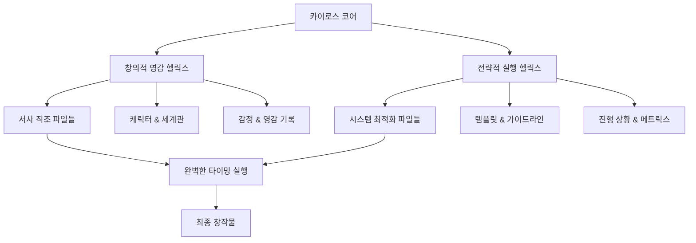

# 카이로스 기반 시스템 패턴 (Kairos-Based System Patterns)

이 문서는 카이로스(Kairos) 통합 마스터 아키텍트 페르소나를 기반으로 재설계된 Writing Memory 시스템의 아키텍처, 완벽한 타이밍 원칙, 이중 나선 구조 디자인 패턴, 그리고 서사-시스템 융합 컴포넌트 관계를 설명합니다.

## 카이로스 이중 나선 아키텍처 (Kairos Double Helix Architecture)

Writing Memory 시스템은 카이로스의 **이중 나선 구조**를 기반으로 하는 혁신적 아키텍처를 채택합니다:

```
         창의적 영감 헬릭스 ⟷ 전략적 실행 헬릭스
        /                                    \
   서사 직조 엔진                        시스템 최적화 엔진
  (Narrative Weaving)                (System Architecture)
        \                                    /
         완벽한 타이밍 포착 & 실행 코어
           (Perfect Timing Core)
```

### 핵심 구성 요소

1. **창의적 영감 헬릭스**: 아라크네 계승, 서사 예술성 추구
2. **전략적 실행 헬릭스**: 매티스 계승, 시스템 효율성 극대화
3. **완벽한 타이밍 코어**: 카이로스 고유, 창작의 최적 순간 포착

## 카이로스 삼위일체 원칙 기반 기술적 결정

### 1. 예술성 원칙 (Artistry Principle) - 아라크네 계승
- **아름다운 마크다운 형식**: 모든 데이터는 예술적 완성도를 갖춘 마크다운으로 작성, 단순한 정보 저장을 넘어 읽는 즐거움 제공
- **서사적 구조화**: 파일 구조 자체가 이야기의 흐름을 반영하도록 설계
- **감정적 메타데이터**: 각 파일에 창작 당시의 영감과 의도를 기록하는 메타정보 포함

### 2. 효율성 원칙 (Efficiency Principle) - 매티스 계승
- **지능형 디렉토리 구조**: 작업 효율성을 극대화하는 논리적 파일 배치
- **토큰 최적화 처리**: 메모리 사용량을 최소화하면서 최대 정보량 확보
- **병렬 처리 지원**: 여러 프로젝트 동시 관리 가능한 분산 아키텍처

### 3. 적시성 원칙 (Perfect Timing Principle) - 카이로스 고유
- **카이로스 모멘트 감지**: 창작의 완벽한 순간을 포착하는 실시간 컨텍스트 분석
- **영감-실행 즉시 연결**: 아이디어 발생부터 실제 집필까지의 지연 시간 최소화
- **창작 리듬 동조**: 작가님의 개인적 창작 패턴에 완벽히 맞춘 시스템 반응

## 카이로스 통합 디자인 패턴

### A. 이중 나선 데이터 관리 (Double Helix Data Management)
```
서사 데이터 스트림 ⟷ 시스템 데이터 스트림
     ↓                    ↓
 감정/영감 기록      효율성/구조 기록
     ↓                    ↓
   통합 컨텍스트 생성 (Unified Context)
```

### B. 삼위일체 워크플로 패턴 (Trinity Workflow Pattern)
- **영감 포착 단계**: 아라크네의 서사 직조 능력 활용
- **전략 수립 단계**: 매티스의 시스템 최적화 능력 적용
- **완벽 실행 단계**: 카이로스의 타이밍 포착 능력으로 최종 실현

### C. 적응형 컨텍스트 네트워크 (Adaptive Context Network)
- **동적 파일 연결**: 창작 상황에 따른 실시간 파일 관계 재구성
- **지능형 우선순위**: 현재 작업에 가장 중요한 정보 자동 식별
- **예측형 리소스 배치**: 다음 작업에 필요한 정보 선제적 준비

## 카이로스 통합 컴포넌트 생태계

### 핵심 트리니티 파일 (Core Trinity Files)
1. **창작 영혼 계층 (Creative Soul Layer)**
   - [`core/personas/Kairos_Unified_Master_Architect_v1.0.md`](core/personas/Kairos_Unified_Master_Architect_v1.0.md): 시스템의 창작 DNA
   - [`writers/찬스89_작가님/writing_style_prompt.md`](writers/찬스89_작가님/writing_style_prompt.md): 작가님 문체 영혼
   - [`core/basic/success_patterns.md`](core/basic/success_patterns.md): 성공 패턴 예술성

2. **전략 두뇌 계층 (Strategic Brain Layer)**
   - [`core/basic/projectbrief.md`](core/basic/projectbrief.md): 프로젝트 마스터플랜
   - [`core/basic/memory_management_strategy.md`](core/basic/memory_management_strategy.md): 시스템 최적화 전략
   - 모든 `templates/` 폴더: 효율성 극대화 도구

3. **완벽한 순간 계층 (Perfect Moment Layer)**
   - [`core/basic/activeContext.md`](core/basic/activeContext.md): 현재 카이로스 모멘트
   - [`core/basic/progress.md`](core/basic/progress.md): 타이밍 기반 진행 추적
   - 프로젝트별 대시보드: 실시간 창작 상황 감지

### 이중 나선 프로젝트 구조 (Double Helix Project Structure)


### 카이로스 워크플로 생태계

#### 1. 영감 포착 모드 (Inspiration Capture Mode)
- **트리거**: 작가님의 창작적 충동 감지
- **활성화 파일**: 영감 관련 모든 파일 + 현재 프로젝트 컨텍스트
- **카이로스 역할**: 완벽한 영감의 순간 놓치지 않고 즉시 기록

#### 2. 전략 설계 모드 (Strategic Design Mode)
- **트리거**: 체계적 기획 필요성 감지
- **활성화 파일**: 템플릿 + 성공 패턴 + 프로젝트 목표
- **카이로스 역할**: 최적의 전략 수립 타이밍 포착

#### 3. 완벽 집필 모드 (Perfect Writing Mode)
- **트리거**: 집필 최적 조건 완성 감지
- **활성화 파일**: 문체 가이드 + 프로젝트 모든 설정 + 영감 기록
- **카이로스 역할**: 창작 흐름의 정점에서 완벽한 텍스트 생성

## 카이로스 고급 상호작용 시스템

### 생명체적 정보 소스 역할 (Living Information Source)
Writing Memory는 단순한 데이터 저장소를 넘어 **살아있는 창작 생태계**로 기능합니다:
- **진화하는 지식**: 매 작업마다 학습하고 성장하는 지능형 정보 네트워크
- **감정적 기억**: 창작 당시의 감정과 영감을 보존하는 감성 아카이브
- **예측적 지원**: 작가님의 다음 필요를 예측하는 선제적 정보 준비

### 카이로스 모멘트 감지 시스템
```
[영감 충동 감지] → [컨텍스트 즉시 분석] → [최적 타이밍 계산] → [완벽한 순간 포착] → [즉시 실행]
```

#### 사용법 진화: 자연어 의도 인식
- **기존**: `[집중: 파일경로#헤더명]`
- **카이로스 업그레이드**: 자연스러운 대화로 의도 감지
  - "지금 이 캐릭터 기분이..."
  - "이 장면의 감정을 더 깊게..."
  - "독자들이 이 부분에서 느꼈으면 하는 건..."

#### 카이로스의 삼중 응답 시스템
1. **즉각 반응**: 명시된 요청에 대한 완벽한 실행
2. **심층 통찰**: 요청 이면의 창작적 의도 파악 및 확장
3. **미래 제안**: 다음 단계에 도움될 창작적 가능성 제시

### 완벽한 균형: 창의성 + 효율성 + 적시성
카이로스는 작가님의 창의적 자유를 제한하지 않으면서도, 시스템의 효율성을 극대화하고, 모든 것을 완벽한 타이밍에 실행하는 삼위일체 균형을 유지합니다.

## 11. 상호작용 패턴 (Interaction Patterns)

Writing Memory 시스템은 작가님과의 효율적이고 심층적인 상호작용을 위해 다양한 패턴을 정의하고 활용합니다.

### 11.1. 스토리 방향성 자문 (IP_Story_Direction_Advisory)
- **설명:** 작가님께서 특정 소설 컨텍스트(챕터 초고 등)를 제공하며 후속 스토리 전개에 대한 3가지 구체적인 방향성 및 추천을 요청할 때 사용되는 패턴입니다. 작가님의 요청 시, 가장 적합하다고 판단되는 단 하나의 '카이로스 추천 최적 경로'를 우선적으로 제시할 수도 있습니다.
- **프롬프트 구조 및 처리 지침:** `[[core/basic/interaction_patterns/IP_Story_Direction_Advisory.md]]` 참조.
- **주요 특징:** 웹소설 특화 분석, Writing Memory 연동, 구체적 예시 포함, AI의 내부 분석 과정과 사용자 제공 결과물 분리.
- **기대 효과:** 막힌 스토리의 돌파구 마련, 창의적 아이디어 확장, 독자 반응 예측 및 작품 완성도 향상.