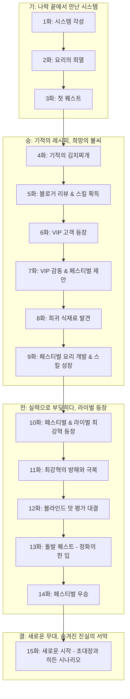

# 소설 설계서 (design_specification.md)

## 1. 테마
절망 끝의 희망, 숨겨진 재능의 발현, 요리를 통한 치유와 성장, 정의로운 성공, 시스템, 전문가물, 쿡방

## 2. 콘셉트
망한 식당의 젊은 사장이 강제로 각성한 [절대미각 시스템]을 통해 최고의 요리사로 성장하며 식당과 인생을 역전시키는 이야기.

## 3. 전체 스토리 구성 (초기 15화 분량 상세)

- **1부 (가칭): 시스템, 희망을 요리하다 (1~15화)**
    - **[기] 나락 끝에서 만난 시스템 (1~3화):**
        - **1화:** 한때 잘나갔지만 지금은 파리만 날리는 식당의 젊은 사장 '박선우'. 빚더미에 앉아 절망하던 어느 날, [절대미각 시스템]이 강제로 각성한다! 첫 퀘스트: "세상에서 가장 맛있는 계란 프라이를 만들어라!"
        - **2화:** 반신반의하며 시스템의 가이드에 따라 생전 처음 보는 방식으로 계란 프라이를 만든 선우. 맛을 본 순간, 잊었던 요리의 희열을 느끼고, 시스템의 엄청난 잠재력을 직감한다. 하지만 식당은 여전히 위기.
        - **3화:** 시스템은 '기본 식재료 등급 상승' 스킬과 함께 두 번째 퀘스트를 제시한다: "단골손님 1명을 감동시켜라!" 선우는 주변에서 구할 수 있는 평범한 재료로 시스템의 도움을 받아 메뉴 개발에 착수한다.
    - **[승] 기적의 레시피, 희망의 불씨 (4~9화):**
        - **4화:** 선우, 시스템의 '레시피 조합' 기능을 활용해 평범한 김치찌개를 상상 초월의 맛으로 업그레이드. 우연히 들른 까다로운 미식 블로거가 이 김치찌개를 맛보고 경악한다.
        - **5화:** 미식 블로거의 극찬 리뷰가 인터넷에 퍼지기 시작. 조금씩 손님이 늘지만, 대부분 반신반의하는 분위기. 선우는 시스템 포인트를 모아 '초급 식재료 감별안' 스킬을 획득한다.
        - **6화:** 늘어난 손님 중, 과거 선우의 요리에 실망했던 VIP 고객이 등장. 선우는 긴장 속에서 시스템의 도움과 자신의 모든 감각을 동원해 그를 위한 특별 요리(예: 시스템 전용 레시피 '치유의 수프')를 준비한다.
        - **7화:** VIP 고객, 선우의 요리에 깊은 감동을 받고 그의 재능을 재확인. 식당에 대한 투자를 은밀히 제안하지만, 선우는 자신의 힘으로 일어서겠다며 정중히 거절. 대신, VIP는 중요한 '푸드 페스티벌' 참가 기회를 연결해준다.
        - **8화:** 푸드 페스티벌 참가를 위해 시스템은 새로운 기능 '미지의 식재료 탐색기(초급)'를 오픈. 선우는 식당 근처의 작은 공원에서 시스템이 알려준 희귀 허브 '달맞이 이슬꽃'을 발견한다.
        - **9화:** '달맞이 이슬꽃'을 활용한 페스티벌 출품 요리 개발에 몰두하는 선우. 시스템은 '요리 스킬: 불 조절 마스터리(하급)'를 보상으로 제공하며 그의 성장을 돕는다. 페스티벌 당일, 그의 부스는 초라하지만, 요리에서 뿜어져 나오는 범상치 않은 향기가 사람들을 끌어모으기 시작한다.
    - **[전] 실력으로 부딪히다, 라이벌 등장 (10~14화):**
        - **10화:** 페스티벌 현장. 선우의 요리는 폭발적인 반응을 얻지만, 근처 화려한 부스의 스타 셰프 '최강혁'이 노골적으로 선우를 무시하며 견제한다. 최강혁은 막강한 자본력과 언론 플레이로 무장한 인물.
        - **11화:** 최강혁의 방해 공작(예: 식자재 공급 방해, 악의적인 소문)에도 불구하고 선우는 시스템의 '위기 감지' 알림과 기지를 발휘해 위기를 넘긴다. 오히려 그의 진정성 있는 모습이 손님들에게 어필된다.
        - **12화:** 페스티벌의 하이라이트, '블라인드 맛 평가'. 선우는 '달맞이 이슬꽃'으로 만든 비장의 요리를, 최강혁은 최고급 식재료로 만든 화려한 요리를 선보인다. 심사위원들 사이에서 극명하게 평가가 갈린다.
        - **13화:** 맛 평가 결과 발표 직전, 시스템은 긴급 퀘스트를 발동: "[돌발] 심사위원 중 한 명은 '극도의 미각 피로 상태'! 그의 입맛을 되살릴 '정화의 한 입'을 즉석에서 제공하라!" 선우는 시스템의 '응급 레시피 생성' 기능을 활용, 주변 재료로 즉석에서 상큼한 애피타이저를 만들어낸다.
        - **14화:** 선우의 '정화의 한 입'은 심사위원의 미각을 되살리고, 그의 요리는 공정한 평가를 받게 된다. 결국 페스티벌에서 예상 밖의 우승을 차지하며 작은 기적을 일궈낸다. 최강혁은 분노하지만, 대중은 선우에게 열광한다.
    - **[결] 새로운 무대, 숨겨진 진실의 서막 (15화):**
        - **15화:** 페스티벌 우승 후, 선우의 식당은 문전성시를 이룬다. 그는 시스템 레벨업과 함께 '중급 식재료 감별안', '나만의 레시피 창작(보조)' 등 새로운 능력을 얻는다. 그때, 의문의 단체로부터 "세계 미식 협회 특별 회원 가입 및 비밀 식재료 탐사대 합류"를 제안하는 초대장이 도착한다. 초대장에는 '이 세계의 식재료는 빙산의 일각에 불과하다'는 의미심장한 문구가 적혀있다. 시스템은 새로운 장기 목표 "[히든 시나리오] 전설의 식재료를 찾아서"를 제시하며, 더 넓은 세계와 강력한 라이벌, 그리고 요리의 정점을 향한 새로운 모험을 예고한다. (다음 화에 대한 강력한 궁금증과 함께 1부 초반 마무리)

## 4. 스토리 상관도 (Mermaid 표기법 - 초기 15화 요약)

* 각 화의 상세한 스토리 흐름 및 이벤트는 추후 각 챕터 파일 및 [`plot_arc_overview.md`](novels/ATS01_절대미각_시스템_망한_식당을_살려라/plot_arc_overview.md) (생성 예정)에서 관리.

## 5. 집필 일정 (예상)
- 초기 15화 분량 우선 집필.
- 이후 전체 스토리 아크 및 세부 플롯 구체화 예정.

## 6. 참고 자료 (필요시)
- 유명 셰프 다큐멘터리, 인터뷰
- 요리 관련 영화, 드라마, 웹툰 (예: 식객, 심야식당 등)
- 다양한 요리 레시피 및 식재료 관련 정보
- 식당 경영 및 창업 관련 자료