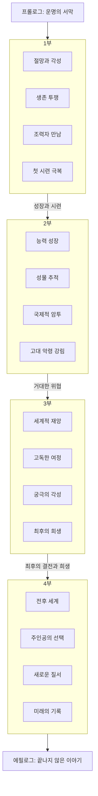

# 소설 설계서 (design_specification.md)

## 1. 테마
역사의 이면, 선택과 대가, 기록과 기억의 힘, 인간의 욕망, 생존과 성장, 운명 개척, K-오컬트 미스터리

## 2. 콘셉트
몰락한 천재 미술품 복원가가 고대의 저주받은 먹 '삼한비록지묵(진묵)'을 통해 '기록자'로 각성하고, 거대한 음모와 초월적 위협에 맞서 싸우며 잊혀진 진실을 파헤치는 장대한 현대 판타지 액션 드라마.

## 3. 전체 스토리 구성 (상세 내용은 plot_arc_overview.md 참조)

- **프롤로그:** (필요시 추가) 이야기의 시작을 알리는 암시 또는 과거의 사건 제시.
- **1부: 검은 먹물의 각성 (약 1~30화)**
    - 주인공 이도윤의 절망적인 현실과 '진묵'과의 첫 만남, 강제 각성.
    - 생존을 위한 투쟁과 숨겨진 세계(화백회, 흑월단)의 발견.
    - 조력자(골동품상, 현오 스님 등)와의 만남과 첫 번째 시련 극복.
    - 자신의 운명을 어렴풋이 인지하고 성장을 다짐.
- **2부: 잊혀진 역사, 드러나는 음모 (약 31~70화)**
    - 본격적인 능력 성장과 '진묵'과의 관계 심화.
    - 국내외를 무대로 다른 성물 추적 및 역사 미스터리 해결.
    - 다양한 적대 세력(흑월단, 용비대, 국혼사)과의 격돌 및 국제적 스케일 확장.
    - 거대한 음모의 실체 접근 및 차원 문 개방 저지, 고대 악령 강림.
- **3부: 신화의 재림, 운명의 선택 (약 71~120화)**
    - 세계적 재앙 발생 및 '진묵'의 침묵.
    - 주인공의 고독한 싸움과 새로운 성물 탐색 여정.
    - '진묵' 부활 및 완전한 동조, 반신의 경지 도달.
    - 세계 멸망을 시도하는 최종 보스(고대 악령/이계 존재)와의 최후 결전 및 희생.
- **4부 (혹은 에필로그 격): 새로운 시대의 기록자 (약 121~200화+)**
    - 전쟁 이후 폐허 속 새로운 질서 모색.
    - 주인공의 귀환과 선택 (힘의 공개, 조직 창설 또는 재건 등).
    - 남겨진 인물들과의 관계 재정립 및 미래를 향한 희망.
    - 새로운 시대의 '기록자'로서의 삶과 끝나지 않은 위협 암시.
- **에필로그:** (필요시 추가) 모든 사건 이후의 이야기나 다음 시즌을 암시하는 내용.

## 4. 스토리 상관도 (Mermaid 표기법 - 전체 아크 요약)

* 각 부의 상세한 스토리 흐름 및 이벤트는 [`plot_arc_overview.md`](novels/LEGEND01_내가%20먹물로%20새기는%20전설/plot_arc_overview.md) 및 각 Arc별 상세 문서에서 관리.

## 5. 집필 일정 (예상)
- 전체 200화+ 예상, 각 부의 분량은 유동적.
- 현재 1~4화 내용 반영 완료.
- [`plot_arc_overview.md`](novels/LEGEND01_내가%20먹물로%20새기는%20전설/plot_arc_overview.md)를 기준으로 각 부의 세부 플롯 작성 및 집필 진행.

## 6. 참고 자료 (필요시)
- 한국 전통 미술, 서예, 먹 관련 자료
- 삼국시대, 고조선 등 고대사 및 신화 관련 자료
- 국내외 유적지, 박물관 정보
- 오컬트, 미스터리, 판타지 장르의 영화, 드라마, 소설 (연출 및 전개 방식 참고)
- 각국 비밀 조직, 첩보 활동 관련 자료