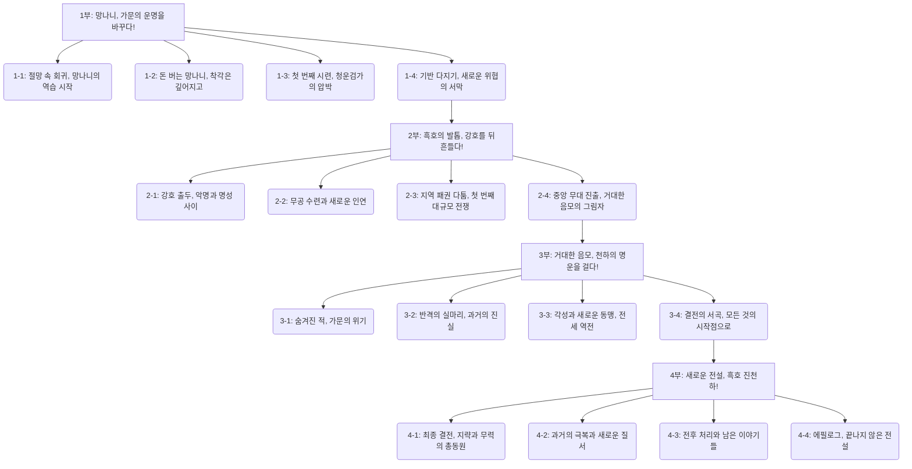

# 작품 디자인 명세 (design_specification.md)

## 1. 작품 개요

*   **작품명 (가제):** 「삼류 악당 가문의 망나니는 회귀자입니다」
*   **소설 코드:** NEW_VILLAIN01
*   **작가:** 찬스89_작가님
*   **장르:** 퓨전 무협, 회귀물, 가문 경영, 착각계, 사이다
*   **총 예상 편수:** 약 200화
*   **전체 로그라인:** 현대에서 스타트업 CEO로 살다 배신으로 죽은 후, 무협 세계 삼류 악당 가문의 망나니로 빙의해 또다시 멸망을 경험한 주인공 '진천하'. 과거로 회귀한 그가 현대의 지식과 두 번의 처절한 삶에서 얻은 각성을 바탕으로, '망나니 연기'라는 가면 뒤에서 가문을 부흥시키고 강호의 새로운 전설로 거듭나는 이야기.

## 2. 주요 테마 및 콘셉트

*   **핵심 테마:** 절망 끝의 재도전, 가면 뒤의 진실, 개인의 성장을 통한 가문과 세상의 변화
*   **주요 콘셉트:**
    *   **망나니 연기:** 주인공이 자신의 진짜 능력과 의도를 숨기기 위한 전략적 위장.
    *   **착각계 유머:** 주인공의 행동을 주변 사람들이 오해하며 발생하는 코믹한 상황.
    *   **현대 지식 활용:** 주인공이 현대 CEO 시절의 경험과 지식을 무협 세계에 적용하여 문제를 해결하고 기회를 창출.
    *   **사이다 복수 및 위기 극복:** 주인공을 무시하거나 위협하는 세력에게 통쾌하게 복수하고, 가문의 위기를 기발한 방법으로 해결.
    *   **가문 경영 및 성장:** 몰락한 가문을 일으켜 세우고 강력한 세력으로 키워나가는 과정.

## 3. 200화 장편 플롯 아웃라인

### 1부 (1~50화): 망나니, 가문의 운명을 바꾸다!

*   **아크 목표:** 멸문 직전의 흑호 진가를 위기에서 구하고, 초기 자본과 기반을 마련하며 가문 부흥의 초석을 다진다. 주인공 '진천하'는 '미친 망나니'라는 가면을 쓰고 자신의 능력을 숨긴 채, 주변의 착각을 유도하며 첫 번째 목표(청운검가 빚 해결)를 달성한다.
*   **주요 단계:**
    *   **(1~10화) 절망 속 회귀, 망나니의 역습 시작:**
        *   멸문 직전의 흑호 진가, 빚쟁이들 앞에서 망나니 '진천하'가 광기 어린 선언과 함께 회귀했음을 각인시킨다.
        *   미래 지식과 현대적 상술(예: '꿀꺽주' - 숙취해소와 기력회복 기능이 있는 약주 개발 및 초기 자본 확보)로 첫 번째 위기를 기상천외하게 해결하며 주변을 경악시킨다.
        *   내부의 배신자(예: 가문 정보를 빼돌리던 하인, 빚쟁이와 내통하던 방계 친척)를 숙청하며 가문의 기강을 다잡는다.
    *   **(11~25화) 돈 버는 망나니, 착각은 깊어지고:**
        *   '꿀꺽주' 사업 대박 행진. (초기에는 직접 제조 및 소량 판매, 이후 레시피를 담보로 자금 융통 또는 생산 외주화 등 현대적 사업 확장 방식 도입)
        *   몰락한 상단 행수, 빚 때문에 곤경에 처한 실력 있는 무인 등 충직한 조력자들을 확보한다. (그들은 진천하의 망나니짓 이면에 숨겨진 비범함을 간파하거나, 혹은 절박함에 지푸라기라도 잡는 심정으로 합류)
        *   경쟁 상단 및 소규모 빚쟁이들을 망나니다운 방식(예: 역정보 흘리기, 기상천외한 내기 제안, 조폭식 협박과 회유)으로 박살 내며 자금을 불린다.
        *   진천하의 기행에 주변인들은 "미친 천재", "종잡을 수 없는 인물"이라는 착각을 굳히고, 그의 숨겨진 의도를 멋대로 해석하며 추종하거나 두려워하기 시작한다.
    *   **(26~40화) 첫 번째 시련, 청운검가의 압박:**
        *   '청운검가'가 흑호 진가의 성장을 견제하며 본격적인 압박(빚 독촉 강화, '꿀꺽주' 유통 방해, 상단 습격, 무력시위 등)을 가해온다.
        *   진천하는 정면 대결보다는 그들의 약점(예: 청운검가 내부의 후계자 다툼, 숨겨진 비리 장부, 과거의 치부)을 파고들어 교란시키고, 주변 중소 가문들과의 일시적 연대(예: 공동 사업 제안, 정보 공유)를 통해 위기를 극복한다.
        *   이 과정에서 숨겨왔던 무재(武才)의 편린(예: 위기 상황에서의 번뜩이는 기지, 혹은 회귀 전 익혔던 기초 무공의 응용)을 살짝 드러내어, 조력자들의 신뢰를 얻고 적들에게는 혼란을 준다.
    *   **(41~50화) 기반 다지기, 새로운 위협의 서막:**
        *   청운검가와의 갈등을 일단락 짓고(빚 일부 변제 및 휴전 협정, 혹은 청운검가 내부 문제로 인한 일시적 후퇴 유도), 확보한 자금과 명성(악명?)으로 가문의 무력을 재건(용병 고용, 무기 확보, 방어 시설 보강)하고 새로운 사업(예: 정보 길드 '흑호방', 특수 물품 운송업 등)의 기반을 닦는다.
        *   멸문의 가장 큰 원인이었던 거대 세력의 음모 또는 더 큰 위협의 단초가 드러나며 1부 마무리. (예: 지역 패권을 노리는 '오룡상단 연합'의 등장, 혹은 정파 명문 '칠성맹'의 흑호 진가에 대한 의심과 견제 움직임)
*   **1부 클라이맥스:** 청운검가의 압박을 성공적으로 막아내고 빚 문제 해결의 실마리를 마련. '꿀꺽주' 사업 성공 및 신규 사업 착수로 가문 재정 안정화. 진천하의 '미친 망나니' 명성이 강호에 조금씩 퍼지기 시작.

### 2부 (51~100화): 흑호의 발톱, 강호를 뒤흔들다!

*   **아크 목표:** 흑호 진가의 세력을 본격적으로 확장하고, 강호에 '진천하'의 이름을 확실히 각인시킨다. 주인공은 무공 수련과 인재 영입을 통해 내실을 다지고, 지역 패권 다툼에서 승리하여 중앙 무대로 나아갈 발판을 마련한다.
*   **주요 단계:**
    *   **(51~65화) 강호 출두, 악명과 명성 사이:**
        *   진천하는 본격적으로 강호에 이름을 알리기 시작한다. (예: 유명 문파의 경연 참가, 해결사 의뢰 수락 등)
        *   망나니 특유의 방식(예: 판을 엎어버리거나, 규칙을 교묘하게 이용)으로 기연을 독식하거나, 약자를 돕는 척하며 실리를 챙기고(예: 위기에 처한 상단을 도와주고 지분 확보), 악당들을 처단하며 '의로운 망나니' 혹은 '종잡을 수 없는 미친놈'으로 명성을 떨친다.
        *   가문의 사업은 강호 전역으로 확장된다. (예: '흑호방'의 정보망 확대, '꿀꺽주' 전국 유통망 구축)
    *   **(66~80화) 무공 수련과 새로운 인연:**
        *   회귀 전의 기억과 현대적 수련법(예: 이미지 트레이닝, 효율적인 체력 단련법)을 결합하여 빠르게 무공을 성장시킨다.
        *   이 과정에서 뜻밖의 스승(예: 은거 기인, 몰락한 고수)을 만나거나, 강력한 무공 비급(혹은 그 단서)을 얻는다.
        *   또한, 미래의 중요 인물이 될 잠재력 있는 인재들을 발굴하여 자신의 편으로 끌어들인다. (예: 멸망할 문파의 마지막 후예를 구출하여 충성을 얻음, 재능을 숨긴 기녀를 정보원으로 활용, 억울하게 누명 쓴 실력자를 도와주고 가신으로 삼음)
    *   **(81~95화) 지역 패권 다툼, 첫 번째 대규모 전쟁:**
        *   흑호 진가가 성장하면서 지역 패권을 둘러싼 기존 강자들(예: 오룡상단 연합, 지역 토호 세력)과의 충돌이 불가피해진다.
        *   진천하는 뛰어난 지략(정보전, 심리전, 이간계)과 망나니다운 대담함(허를 찌르는 기습, 과감한 배팅)으로 연합과 배신을 거듭하며, 몇 차례의 큰 전투와 암투 끝에 지역의 새로운 강자로 떠오른다.
        *   이 과정에서 강력한 라이벌(예: 오룡상단 연합의 젊고 야심찬 후계자, 혹은 정파의 신진 고수)이 등장하거나, 과거의 악연(예: 현대에서 자신을 배신했던 동업자와 닮은 인물)과 마주친다.
    *   **(96~100화) 중앙 무대 진출, 거대한 음모의 그림자:**
        *   지역 패권을 장악한 진천하와 흑호 진가는 이제 중앙 정계 또는 무림맹과 같은 더 큰 무대로 나아갈 발판을 마련한다. (예: 무림맹의 정식 일원으로 인정받거나, 황실로부터 특정 관직을 제수받음)
        *   하지만, 과거 가문을 멸망시켰던 배후 세력(예: 칠성맹 내부의 강경파, 혹은 황실을 조종하는 환관 세력)의 윤곽이 드러나기 시작하며, 거대한 음모가 흑호 진가를 옥죄어 온다.
*   **2부 클라이맥스:** 지역 패권 장악 및 중앙 무대 진출 성공. 그러나 동시에 과거 가문 멸망의 배후 세력과 본격적으로 대립하기 시작.

### 3부 (101~150화): 거대한 음모, 천하의 명운을 걸다!

*   **아크 목표:** 가문을 멸망시켰던 거대한 배후 세력의 실체를 파헤치고, 절체절명의 위기 속에서 반격의 기회를 모색한다. 주인공은 개인적인 각성을 이루고 새로운 동맹을 규합하여 전세를 역전시킬 준비를 한다.
*   **주요 단계:**
    *   **(101~115화) 숨겨진 적, 가문의 위기:**
        *   배후 세력(예: 황실 내 특정 파벌 '흑룡회', 혹은 수백 년간 암약해온 비밀결사 '천마신교 잔당')의 본격적인 공격이 시작된다.
        *   흑호 진가는 정치적(누명, 고립), 경제적(주요 사업 방해, 자금줄 차단), 무력적으로(암살 시도, 정규군 투입) 절체절명의 위기에 빠진다.
        *   믿었던 동료의 배신이나 예상치 못한 내부 분열(예: 가문 원로들의 반발, 조력자의 이탈)이 발생할 수도 있다.
    *   **(116~130화) 반격의 실마리, 과거의 진실:**
        *   진천하는 절망적인 상황 속에서도 포기하지 않고 반격의 실마리를 찾아 나선다. (예: 배후 세력의 내부 정보 빼내기, 과거 사건 재조사)
        *   이 과정에서 회귀 전에는 몰랐던 가문의 숨겨진 비밀(예: 선조가 남긴 비급 '흑호비전', 혹은 가문이 지켜온 중요한 사명 - 전설의 신병 수호 등)이나, 배후 세력의 결정적인 약점(내부 권력 다툼, 숨겨진 과거의 죄악)이 드러난다.
    *   **(131~145화) 각성과 새로운 동맹, 전세 역전:**
        *   주인공은 위기를 극복하는 과정에서 새로운 깨달음을 얻거나 무공의 경지가 한 단계 도약한다(각성 - 예: 흑호비전의 진정한 힘 개방, 현대 지식과 무공의 융합).
        *   또한, 과거의 적이었던 세력(예: 청운검가 잔존 세력)과 일시적으로 손을 잡거나, 예상치 못한 새로운 강력한 동맹(예: 핍박받던 소수민족, 혹은 사파의 의로운 세력)을 얻어 전세를 뒤집기 시작한다.
        *   ‘망나니’ 진천하의 진면목(뛰어난 통찰력과 리더십, 사람을 끌어당기는 카리스마)이 드러나며 주변의 착각은 존경과 경외로 바뀐다.
    *   **(146~150화) 결전의 서곡, 모든 것의 시작점으로:**
        *   배후 세력의 핵심에 접근하게 된 진천하. 모든 음모의 시작점이 된 과거의 특정 사건(예: 황실의 비극, 혹은 특정 문파의 몰락)이나 장소(예: 봉인된 고대 유적, 혹은 배후 세력의 비밀 본거지)로 향하며, 최종 결전을 예고한다.
*   **3부 클라이맥스:** 배후 세력의 실체와 약점 파악. 주인공의 각성 및 강력한 동맹 확보. 최종 결전을 위한 모든 준비 완료.

### 4부 (151~200화): 새로운 전설, 흑호 진천하!

*   **아크 목표:** 배후 세력과의 최종 결전에서 승리하여 모든 음모를 분쇄하고 강호에 새로운 질서를 확립한다. 주인공은 과거의 트라우마를 완전히 극복하고, 흑호 진가를 명실상부한 천하제일가로 만들며 살아있는 전설로 거듭난다.
*   **주요 단계:**
    *   **(151~170화) 최종 결전, 지략과 무력의 총동원:**
        *   배후 세력의 본거지에서 최후의 결전이 벌어진다. (수적으로 불리한 상황, 강력한 최종 보스와의 대결)
        *   주인공은 자신이 가진 모든 지략(현대 전술 응용, 심리전), 무력(각성한 무공, 비장의 수), 인맥(조력자 총집결, 동맹군과의 연합 작전)을 총동원하여 강력한 적들과 맞서 싸운다.
        *   수많은 위기(아군의 희생, 예상치 못한 적의 함정)와 반전(숨겨진 조력자의 등장, 적 내부의 분열 유도)이 거듭되며 독자들의 손에 땀을 쥐게 한다.
    *   **(171~185화) 과거의 극복과 새로운 질서:**
        *   최종 보스(예: 흑룡회 수장, 혹은 천마신교 교주)를 물리치고 모든 음모를 분쇄한 진천하.
        *   회귀 전의 트라우마(배신, 멸망, 무력감)를 완전히 극복하고 정신적으로 성장한다.
        *   강호에 새로운 질서(공정, 정의, 약자 보호)를 세우는 데 기여한다. (예: 부패한 무림맹 해체 및 재건, 새로운 규율 선포)
        *   흑호 진가는 강호제일의 명문가로 우뚝 서고, 주인공은 살아있는 전설로 추앙받는다.
    *   **(186~195화) 전후 처리와 남은 이야기들:**
        *   전쟁의 상처를 치유하고, 새로운 시대의 기틀을 마련한다. (예: 피해 지역 복구 지원, 새로운 인재 등용)
        *   조력자들의 뒷이야기(각자의 성장과 행복), 주인공과 맺어진 인연들(히로인과의 관계 발전, 가족의 평화)의 결실 등이 그려진다.
        *   주인공은 '망나니'가 아닌 진정한 지도자로서의 면모를 보여주며 주변의 존경을 받는다.
    *   **(196~200화) 에필로그, 끝나지 않은 전설:**
        *   평화를 되찾은 세상. 진천하는 가주 자리를 후계자(예: 아들, 혹은 가장 신임하는 가신)에게 물려주고 유유자적한 삶을 즐기려 한다.
        *   하지만, 또 다른 세계의 위협(예: 마계의 침공 암시, 혹은 현대 세계와의 연결고리 발견)이나 새로운 모험을 암시하며 이야기가 마무리될 수 있다.
        *   (혹은, 사랑하는 사람들과 함께 평온하고 행복한 삶을 누리는 완벽한 해피엔딩으로 마무리)
*   **4부 클라이맥스 (작품 전체 클라이맥스):** 최종 보스 격파 및 배후 세력 완전 섬멸. 강호의 평화 정착 및 흑호 진가의 위상 공고화. 주인공 진천하, 개인적인 행복과 영웅으로서의 명예를 모두 쟁취.

(본 플롯은 작가의 아이디어와 실제 집필 과정, 독자 반응에 따라 유동적으로 변경될 수 있습니다.)

## 4. 스토리 상관도 (Mermaid 표기법 - 예시)

## 5. 집필 일정 (예상)

*   1부 완료: (날짜)
*   2부 완료: (날짜)
*   3부 완료: (날짜)
*   4부 (완결) 완료: (날짜)

(세부 일정은 작가님과 협의하여 조정)