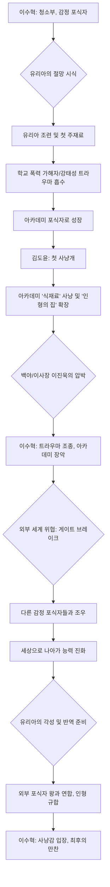

# 소설 설계서

## 테마
생존, 권력, 인간의 어두운 면, 성장, 지배와 피지배, 역습

## 콘셉트
타인의 부정적인 감정을 먹고 성장하는 청소부 주인공이 아카데미를 장악하고, 더 나아가 외부 세계의 포식자들과 대립하며 자신의 능력을 진화시키는 이야기. 조련된 인형들의 반역이라는 반전 요소.

## 스토리 구성
### Part 1. 포식자의 탄생 (1~50화)
아카데미 최하층 청소부 이수혁, 타인의 부정적 감정을 먹고 생존. S급 천재 유리아의 절망을 '시식' 후 첫 '주재료'로 삼음. 유리아 조련 과정에서 학교 폭력 가해자 및 교관 강태성의 트라우마를 맛보며 아카데미의 숨겨진 포식자로 성장. F급 학생 김도윤을 첫 '사냥개'로 얻어 아카데미 공략 준비.

### Part 2. 식탁의 확장 (51~100화)
유리아를 '인형'으로 조련한 이수혁은 김도윤을 이용해 아카데미 내부의 새로운 '식재료'들을 사냥. 학생회 임원, 인싸 학생, 교직원들의 추악한 트라우마와 비밀을 파헤치고, 그들의 절망을 맛보며 '인형의 집' 확장. 아카데미 비밀 결사 '백야'와 이사장 이진욱의 압박에도 불구하고, 그들의 트라우마마저 조종하여 아카데미 전체를 자신의 만찬장으로 만듦.

### Part 3. 주방 밖의 세계 (101~150화)
아카데미를 장악한 이수혁 앞에 외부 세계의 위협이 닥침. 거대한 게이트 브레이크와 함께 자신과 동족인 또 다른 '감정 포식자'들을 마주. 아카데미가 작은 식탁에 불과했음을 깨달은 그는 생존과 더 강렬한 맛을 위해 인형들을 이끌고 세상으로 나아감. 다른 포식자들과의 잔혹한 생존 경쟁 속에서 감정을 '먹는' 것을 넘어, 감정의 흐름을 읽고 미래를 예측하는 등 능력을 진화시킴.

### Part 4. 만찬의 역습 (151~200화)
이수혁에게 조련당하며 그의 능력과 감정의 본질을 깊게 이해하게 된 첫 번째 작품, 유리아가 각성. 그녀는 외부 포식자 세력의 왕과 손잡고, 이수혁에게 속박된 다른 인형들을 규합하여 그의 '식탁'을 전복시키려는 반역 준비. "당신의 그 공허한 영혼은, 과연 어떤 맛일까요?" 가장 완벽했던 요리가 주인의 목을 겨누는 칼날이 되어 돌아온 순간, 포식자였던 이수혁은 처음으로 사냥감의 입장에 서서, 자신의 모든 것을 건 최후의 만찬을 시작.

## 스토리 상관도 (Mermaid 표기법)

## 집필 일정
(정보 필요)