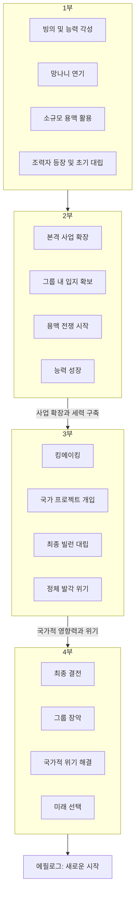

# 소설 설계서 (design_specification.md)

## 1. 테마
망나니의 반전, 숨겨진 능력, 현실 개변, 재벌가의 암투, 대한민국의 운명, 풍수지리, 용맥, 전문가물, 사이다

## 2. 콘셉트
망나니 재벌 3세로 빙의한 주인공이 땅의 기운 '용맥'을 다루는 능력을 각성하여, 몰락 직전의 가문을 일으키고 대한민국의 운명을 뒤흔드는 이야기.

## 3. 전체 스토리 구성 (상세 내용은 plot_arc_overview.md 참조)

- **1부: 망나니의 각성 (1~50화)**
    - 이진우로 빙의 및 상황 파악. 용맥술사 능력 각성.
    - 망나니 연기 & 소규모 용맥 활용 (죽은 상권 살리기, 개인적인 운 개선, 소규모 복수).
    - 윤서아와의 만남 및 초기 갈등/협력.
    - 가문 내 후계자 다툼의 서막 & 이성진의 견제 시작.
- **2부: 용맥, 돈을 부르다 (51~100화)**
    - 용맥술을 활용한 본격적인 사업 확장 (부동산 투자, M&A 등).
    - 진양그룹 내 입지 확보 및 세력 구축.
    - 경쟁 재벌가와의 '용맥 전쟁' 시작.
    - 숨겨진 무속/풍수 세력의 존재 감지.
    - 자신의 능력에 대한 깊은 이해와 성장.
- **3부: 킹메이커의 탄생 (101~170화)**
    - 정치권과의 연결 & '용맥'을 이용한 킹메이킹.
    - 국가적인 프로젝트 개입 (신공항 부지, 국토 개발 등).
    - '그림자 군주' 격인 최종 빌런 세력과의 본격적인 대립.
    - 이진우의 정체가 서서히 드러나며 발생하는 파장.
    - 대한민국의 주요 용맥을 둘러싼 대결 & '용'의 기운 현신.
- **4부: 용의 주인 (171~200화)**
    - 최종 빌런 세력과의 마지막 승부.
    - 진양그룹의 완전한 장악 및 대한민국의 숨은 실력자로 등극.
    - 국가적 위기 극복 및 용맥 안정화.
    - 자신의 정체와 힘을 받아들이고, '용의 주인'으로서의 미래 선택.
- **에필로그:** 재벌 총수이자, 보이지 않는 수호자로서의 삶.

## 4. 스토리 상관도 (Mermaid 표기법 - 전체 아크 요약)

* 각 부의 상세한 스토리 흐름 및 이벤트는 [`plot_arc_overview.md`](novels/YONGMAEK01_재벌%203세는%20용맥술사/plot_arc_overview.md) 및 각 Arc별 상세 문서에서 관리.

## 5. 집필 일정 (예상)
- 전체 200화 내외 완결 목표.
- 각 부의 분량은 유동적.
- [`plot_arc_overview.md`](novels/YONGMAEK01_재벌%203세는%20용맥술사/plot_arc_overview.md)를 기준으로 각 부의 세부 플롯 작성 및 집필 진행.

## 6. 참고 자료 (필요시)
- 재벌가 관련 다큐멘터리, 서적
- 풍수지리, 용맥 관련 전문 서적 및 자료
- 현대 한국 정치, 경제, 사회 관련 뉴스 및 분석 자료
- 기업 경영, M&A, 부동산 개발 관련 자료